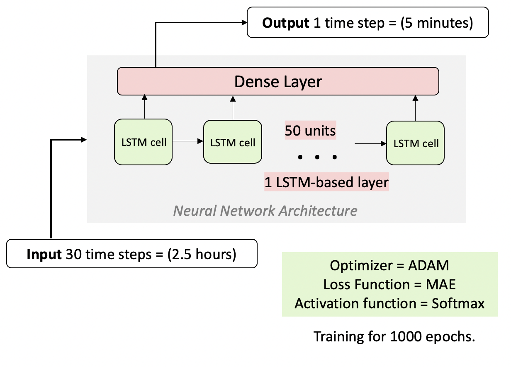
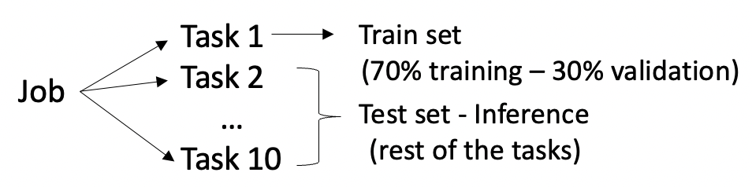
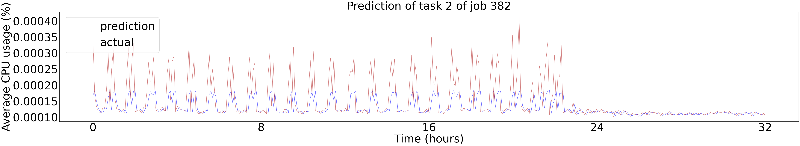
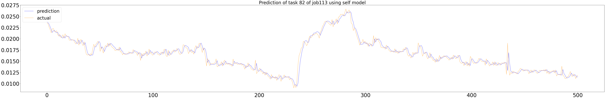

# Cloud resources forecasting using LSTM Neural Networks

This repository contains the code to deploy and train a LSTM model and do inference on test data, using timeseries of CPU usage from Google's trace dataset (2019).

## Repository Structure  

* `docs/` : contains the timeseries data that are used in the experiments. The data can be found in the respective folders, with the label of each job.
*  `train_lstms.py` : deploys and trains a LSTM. Takes one command line argument as input, which is the label of the job that the LSTM will be trained on. It comprises of 3 digits, e.g., '113'. The output created is a folder containing the pre-trained model.
* `inference.py` : infers a timeseries using a pre-trained LSTM model. Takes one command line argument as input, which is the label of the model that will be fetched to do the inference. It comprises of 3 digits, e.g., '113'. The output created is the infered timeseries and a graph of the predicted and the actual values.

## Model Deployment & Training  

We train one model for each job. The training of each model should about 2 minutes on average.

## Model Inference  

For the inference, we choose one model to predict the rest of the tasks of the same job it was trained on. The results are plotted in the same graph as the actual timeseries, as shown below: 

## Paper Reference  
Georgia Christofidi, Konstantinos Papaioannou, and Thaleia Dimitra Doudali. 2023.    Toward Pattern-based Model Selection for Cloud Resource Forecasting.    In 3rd Workshop on Machine Learning and Systems (EuroMLSys ’23), May 8, 2023, Rome, Italy.     https://doi.org/10.1145/3578356.3592588  
 
